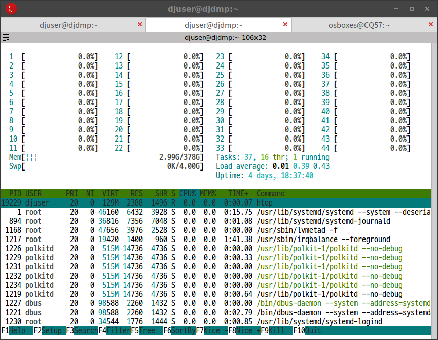
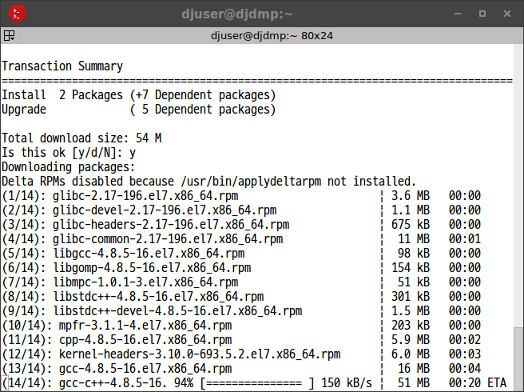
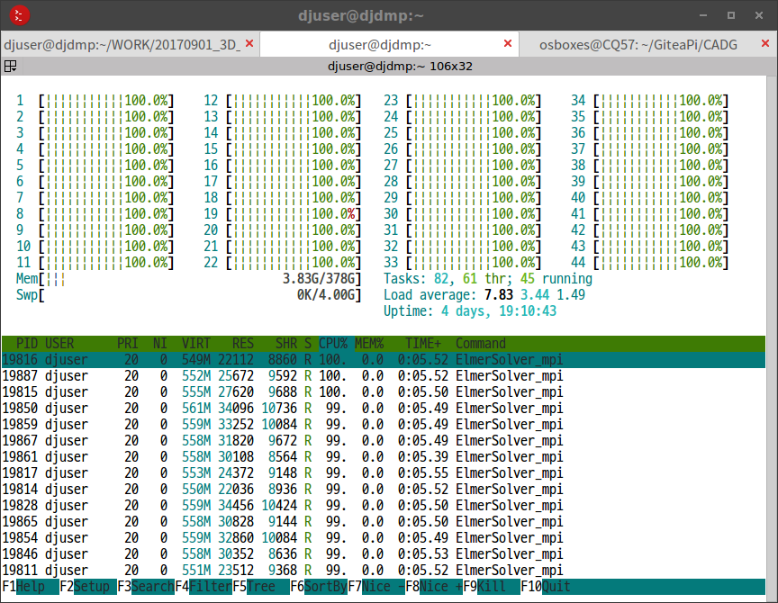
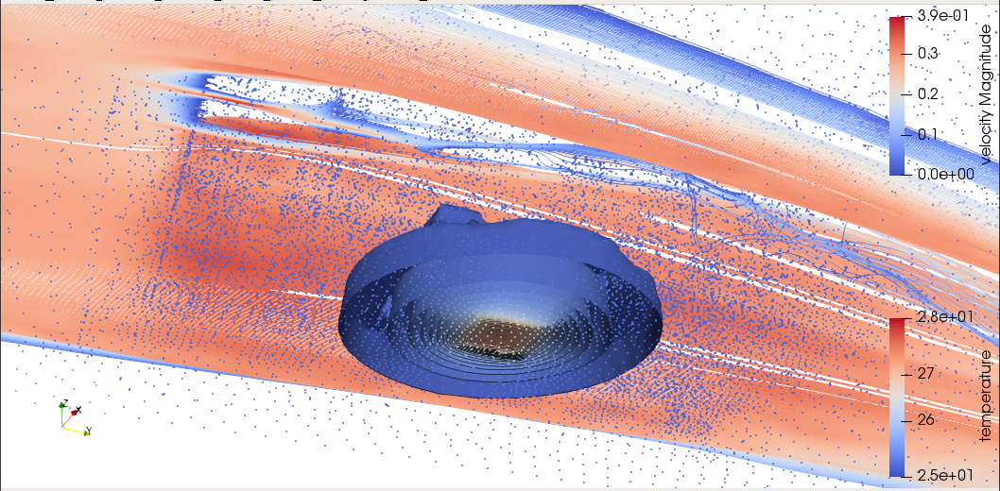

# HPC 자원 활용 테스트 리포트


## HPC 자원 제공 기관
* 기관명 : HPC 이노베이션 허브
* 홈페이지 : [http://openhpc.or.kr](http://openhpc.or.kr)
* 설립 근거 : 과학기술정보통신부 정보통신기술진흥센터(IITP)의 기반조성사업 중 [글로벌 혁신생태계 조성 계획](https://www.iitp.kr/kr/1/business/businessMap/view.it?seq=354)에 의거
* 개소일자 : 2017.09월


## 실무진의 안내 사항들
* 금년말까지 무료 운영, 내년부터 유료 전환 예정이지만, 중소기업 대상으로는 계속 무료 정책을 유지할 확률이 높다.
* ANSYS 라이센스 보유중이며, 필요시 사용할 수 있도록 환경 구축 예정.
* OpenFOAM 셋팅 예정
* 클러스터링, 가상화 환경 구축 예정. (사용자 필요에 따라)
* 기관 외부에서 원격 접속은 현재로서는 허용 계획이 없다.  향후 시스템이 안정화 되면 고려 예정.


## 타임라인
* 20171123, 월간 캐드앤그래픽스 필진 CAE 컨퍼런스 참석했을 때, 홍보물을 받아서 인지함.
* 20171124, 전화문의 후 온라인 예약
* 20171129~30, 센터 방문 및 시스템 테스트 활용 실시


## 할당받은 자원의 사양
* Host Name : djdmp
* CPU : Intel Xeon E5-2699v4 X 2 (44Cores)
* RAM : DDR4 384GB
* OS : CentOS 7.3 Minimal
* 접속방법 : ssh (openhpc.or.kr 접속후 재차 djdmp에 접속)
* 파일교환 : scp (2중 접속이므로 터널링을 통해 연결되도록 셋팅)
* 외부망 연결 : sudo yum 패키지 관리자 사용 권한 허용
* 사용자 계정 : djuser




## 금번 테스트 활용의 목표
* 제공되는 시스템의 특성에 대한 이해
* 오픈소스 CAE 코드들의 작동이 가능한지 여부 확인
* 퍼포먼스 확인
* 예기치 못한 에러 및 문제점 확인
* 실제 실무 문제해결에 사용이 가능한지 종합적으로 검토, 결론 도출


## 유틸리티들 설치 내역

```bash
sudo yum install wget nano git mc
sudo yum groupinstall "Development Tools"
sudo yum install gcc gcc-c++ gcc-gfortran kernel-devel cmake
sudo yum install blas-devel lapack-devel MUMPS openmpi*l
sudo yum -y install epel-release
sudo yum -y install htop
```



## Elmer FEM 설치

* 멀티피직스 솔버
* 홈페이지 : https://www.csc.fi/web/elmer
* cmake 빌드후, 루트권한 없이 사용자 홈 안에 설치

```bash
cd ~/github
git clone https://www.github.com/ElmerCSC/elmerfem
mkdir elmer-build
nano elmer-opts.cmake
```

```
SET(CMAKE_INSTALL_PREFIX "/home/djuser/elmer" CACHE PATH "")
SET(CMAKE_C_COMPILER "gcc" CACHE STRING "")
SET(CMAKE_CXX_COMPILER "g++" CACHE STRING "")
SET(CMAKE_Fortran_COMPILER "gfortran" CACHE STRING "")
```

```bash
cd elmer-build
cmake -C ~/github/elmer-opts.cmake ~/github/elmerfem
make -j44 install
```

* 빌드하는데 수십초 안에 완료됨.  (노트북PC 급에서는 30분 소요되었음)


* `~/.bashrc`에 경로 추가

```bash
# Elmer
export PATH="/home/djuser/elmer/bin/:$PATH"
```

* ElmerSolver with MPI : 다음 예시와 같은 방식으로 실행할 수 있다. (METIS를 이용하여 매쉬 분할 후, MPI로 분할된 매쉬마다 쓰레드 할당하는 기본적인 방식)

```bash
ElmerGrid 2 2 ./Partition -metis 44
mv ./Partition/partitioning.44 ./partitioning.44
rm -r Partition
echo "case21.sif" > ELMERSOLVER_STARTINFO
mkdir case21
mpirun -np 44 ElmerSolver_mpi
```

* 기본 Direct Solver 계산 테스트 성공 : Banded(LAPACK), Umfpack with MPI
* 향상된 Direct Solver 계산 미시도 : MUMPS 설치 성공, 실행은 미처 하지 못함
* iterative Solver 계산 테스트 성공 : BiCGStab with MPI




## Salome Platform 설치

* 전처리기로 사용 가능 (매쉬 생성)
* 홈페이지 : http://www.salome-platform.org/
* 바이너리 빌드본을 다운로드 받아, 루트권한 없이 사용자 홈 안에 설치

```bash
wget -O Salome.tgz "http://www.salome-platform.org/downloads/current-version/DownloadDistr?platform=CO7&version=8.3.0"
tar -xvzf Salome.tgz
mv ./SALOME-* /home/djuser/Salome
rm Salome.tgz
```

* 클라이언트단에서 매쉬 생성 조건 등을 GUI툴로 설정하고, 설정된 파일을 서버단으로 보내서 GUI 없이 백그라운드로 매쉬 생성 계산을 시킬 수 있음.
* 단점은, 오픈소스 매쉬 생성기 중에서 멀티코어 지원되는 코드가 아직 제대로 된 것이 없어서 현실적으로 싱글코어 연산밖에 할 수 없다는 점.
* PC급에서 Salome 등의 오픈소스 매쉬 생성기를 사용할 때, 대체로 10만~30만개 요소망 정도 수준이 현실적으로 한계로 파악됨.  데이타가 더 커지면 안정성과 속도가 너무 느려져서 실무적으로 사용할 수 없음.
* HPC에서 매쉬 생성을 시킬 경우에는, 메모리가 풍부하고 안정성이 좀 더 좋을 것이므로 그보다 좀 더 큰 매쉬 생성이 가능할 것으로 예상됨.
* 매쉬 생성시 낮은 퍼포먼스를 극복하려면, 현재로서는 Salome 대신, 멀티코어 지원되고 안정성과 퍼포먼스가 더 우월한 상용 매쉬 생성기를 사용하는 것이 현실적으로 생각됨.  수백만개 이상의 요소망을 만들기 위해서는 상용 매쉬 생성기가 필수라고 사료됨.
* 금번 테스트 활용에서는, Salome 설치까지는 성공했으나, 실행 단계에서 내부 서버 기동시 localhost 명칭 충돌 때문인지 기동에 실패하였음.  문제 해결에 시간이 부족하여 일단 포기함.


## Paraview 설치

* 후처리기(가시화)
* 시간 부족으로 미처 설치 및 테스트해보지는 못했음.
* HPC에 설치 후에는, 서버단으로 멀티코어로 동작시키고 클라이언트 쪽에서 접속하여 화면을 뿌려받을 수 있음.  이때 전용 포트를 정해서 개방해 줘야 할 필요가 있음.


## 해석 케이스
* Geometry : Simple Heatsink + Fluid Field (Multi Bodies)
* Mesh : 41671 Nodes, ~290000 Elements
* Equations : Heat Conduction (Simple Fourier Model) + Forced Convection with CFD (Navier-Stokes, Bussinesq Buoyancy Model) + k-epsilon Turbulence Model
* Simulation Condition : Steady State, Transient
* 계산 퍼포먼스의 향상 : PC와 직접 정량 비교는 하지 못했으나, 대체로 30배 이상 더 빠르게 향상되었음. (PC에서 4개 코어로 200샷을 계산하는데 48시간 가량 소요되었는데, 동일 조건에서 HPC는 44개 코어로 늦어도 1.5시간 이내에 완료되는 수준)
* 1/100초 단위로 쪼개서 3000 shots Transient 계산 성공 (약 18시간 소요) : 결과물 데이타 용량 23GB 가량, 데이타 파일수 약13만5천개



[유튜브 계산결과](https://youtu.be/ku7TMyk6pO4)


## 테스트 활용 소감
* PC 리눅스와 사용환경이 크게 다르지 않아 쉽게 접근할 수 있었다.
* 기관 실무진들의 친절하고 세심한 대응이 너무 고마웠다.  고압적인 다른 공공기관 공무원들과 질적으로 다른, 우수한 엔지니어들로 실무적으로 잘 조직되어 있다는 생각이 든다.
* 계산 퍼포먼스 향상 정도가 기대치를 뛰어넘는다.
* Elmer 소프트웨어와의 궁합이 매우 좋다는 느낌이 든다.
* 특히 yum 패키지관리자의 도움을 받아 의존성을 해결하니 순식간에 설치 및 셋팅이 완료되고, 별다른 심각한 버그도 안보인다.
* Salome, Paraview를 이용한 전후처리까지 HPC에 셋팅해서 완료하지 못해서 아쉽다.  차후에 시간이 나면 반드시 성공시켜서 완전한 오픈소스 환경 구성의 표준 레시피를 만들어두고 싶다.
* 오픈소스 매쉬 생성기의 낮은 퍼포먼스가, 완전한 오픈소스 툴체인을 구성하는데 가장 큰 병목구간이다.  대규모 요소망을 만들어 고정밀 해석을 하려면 상용 매쉬 생성기가 없이는 현재로서는 어렵지 않나 싶다.


## 중소기업의 현실적 문제
* 대체로, 중소기업 재직 엔지니어들은 공학해석업무에 풀타임으로 집중하기는 곤란한 상황임.
* 중소 제품개발 및 제조업체의 경우, 해석 업무만을 전담하는 전문 엔지니어를 자체 확보하기 어렵기 때문에, 설계 엔지니어가 해석까지 해야 하는 경우가 대부분.
* 중소기업 설계 엔지니어의 경우, 유닉스계열 컴퓨팅 환경의 사용방법과 전문적인 해석 소프트웨어의 깊은 사용법까지 익히고 있는 경우는 매우 드물기 때문에, 사용자 층을 확대하기 위해서는 꾸준한 교육 프로그램이 반드시 필요.
* 보통 중소기업에서 공학 해석 문제를 다룰 수 있는 인원은 1~20명 수준의 소수 인원 뿐이기 때문에, 자체적으로 HPC를 도입하기에는 기계의 사용률이 떨어지기 때문에 채산성이 맞지 않다는 문제가 있음.
* 이에 대한 대안으로 클라우드 컴퓨팅 자원을 사용하는 방법이 있으나, 이 역시 비용적으로 따져보면 기계를 직접 도입하는 것과 비용적으로 별반 차이나지 않음. (아직 클라우드 서비스 가격이 파격적으로 낮은 수준이라고 생각되지는 않음)
* 따라서 여러 중소기업들이 조합을 형성하여 공용 HPC를 함께 이용하는 방안도 있겠지만, 성사되기가 어려운 점이 있음.
* 마지막으로, 'HPC 이노베이션 허브'와 같은 공용 센터가 있어서 저비용으로 자원을 활용할 수 있는 방법이 매우 현실성이 있다고 사료됨.


## 기관에 제안드리고 싶은 사항들
* 성능이 우수한 상용 매쉬생성기를 기관에서 도입해서 사용자할 수 있도록 제공해 주신다면 좋을 것 같다. (대규모 요소망을 만들어 해석 정밀도를 높일 수 있음)
* 컴퓨팅 자원의 가상화 운영도 좋을 것 같다. (클라우드화는 아니더라도, 각 컴퓨터마다 도커 정도만 셋팅해 놔도 관리운영상 훨씬 용이해질 것 같다는 생각이 들었음)
* 기관 외부에서 원격으로 접속 가능하도록 시도해 주었으면 한다.  (회사원의 경우, 기관에 방문하여 며칠~몇주씩 상주 작업하는 것이 현실적으로 상당히 어려운 처지이므로, 회사에서 다른 업무도 보면서 원격 접속해서 작업하도록 해 주는 방식이 더 편리할 것 같음)
* 사용자 교육 프로그램을 꾸준하게 운영해 주셨으면 함.
* HPC의 수요확대, 산업계 전반의 공학수준 향상에도 교육 프로그램이 상당한 영향을 줄 것으로 생각됨.
* 오픈소스 해석 소프트웨어의 운용과 발전에 관심을 가져 주셨으면 함. (신시장, 신규 서비스, 신규 비즈니스 창출 가능.  유럽권의 동향에 주목)


## 향후 관련 활동 계획

### 추후 시간을 내어서 다음 과정을 계속 진행해 보려고 함.
* Salome 및 Python 스크립트를 이용한 HPC상에서의 매쉬 생성 실현
* Paraview를 이용한 HPC상에서의 가시화 실현
* 100만개 이상의 고정밀 매쉬를 이용한 해석 검증

### 실무 문제 해결에 적용
* 일반적인 열전달 방정식이 아닌, Pennes's Bioheat Equation을 커스텀 코딩하여 적용한 전도,복사,대류 복합 열전달 문제 (범용 해석 소프트웨어에서는 잘 지원하지 않으므로, 커스터마이즈가 용이한 오픈소스 해석 소프트웨어에 유리한 문제임) (웨어러블 헬스케어 제품 관련 문제)
* 다수의 발열원이 있는 대규모 복사열전달 문제 (LLLT 의료장비 관련 문제)
* 기타 다양한 문제들을 정의하여 지속적으로 발전 예정

### 에반젤리스트 활동
* 월간지 CAD&Graphics 지면을 통한 소개 (현재 오픈소스 해석 소프트웨어의 입문 사용법 강좌를 연재중인데, 여기에 HPC 이노베이션 허브를 소개하려고 함)
* 기타 온라인 커뮤니티 및 주변 엔지니어들에게 소개할 예정


## 결론
* 제공되는 시스템 : 일반적인 리눅스 환경이라 접근성이 좋고 자유도가 높아서 만족. (100%)
* 오픈소스 CAE 코드들의 작동이 가능한지 여부 : Elmer 확인 완료.  Salome, Paraview 확인 못함. (50%)
* 퍼포먼스 확인 : 기대수준(20x)보다 매우 우수함(30x). (150%)
* 예기치 못한 문제점 : 원격지에서 접근이 안되어 아쉬움 (50%)
* 실제 실무 문제해결에 사용이 가능 여부 : 가능 (100%)

__금번 테스트 활용을 통해, 오픈소스 Elmer FEM Solver 적용이 용이함을 확인하고, 특히 성능향상폭이 높다는 사실을 성공적으로 검증하였고, 실무 문제 해결에 적용 가능함을 입증하였음.__
